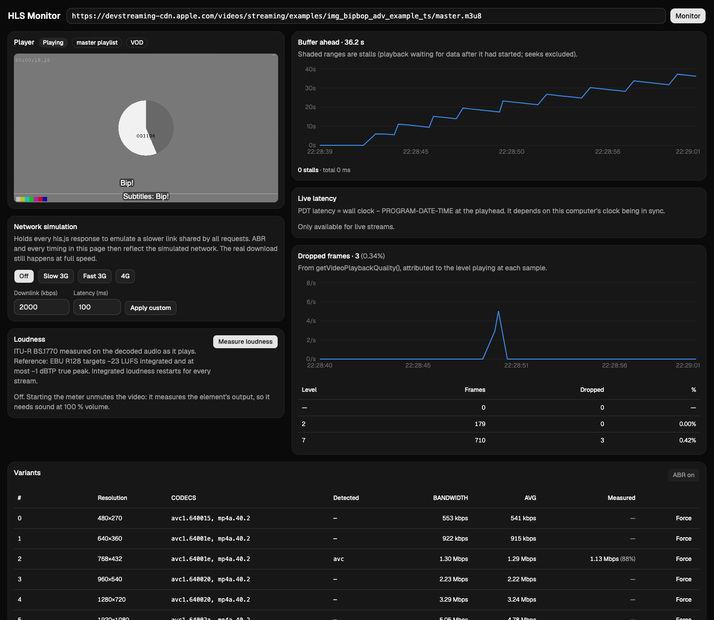

# HLS Monitor

A browser-based monitor for HLS streams. Paste a playlist URL and it plays the stream with
[hls.js](https://github.com/video-dev/hls.js) while measuring the network, the playlists, the
media and the playback in real time. Everything runs in the browser; there is no backend.



## Features

**Network and segments**
- Per-segment TTFB, total time, throughput and download/duration ratio
- Segment timeline with slow, failed and missing segments
- Error log with classified errors (CORS, HTTP 4xx/5xx, timeouts, decode, parse)

**Playlists**
- Refresh health for live playlists: intervals, stale refreshes, segments missed between refreshes
- Spec checks, e.g. EXTINF vs TARGETDURATION, missing CODECS, discontinuities

**Variants**
- Declared bandwidth vs measured bitrate, with a variant you can force
- Alignment between variants: EXTINF, discontinuities, PROGRAM-DATE-TIME and start PTS per
  media sequence number

**MPEG-TS analysis** (in a Web Worker)
- Codec strings read from the stream (H.264 SPS, AAC ADTS) and compared with CODECS
- Real segment duration from PTS vs EXTINF
- Continuity counter errors per PID
- Segment inspector: request timings, PIDs, codecs and response headers

**Playback quality**
- Buffer ahead and stalls
- Live latency (distance to the live edge and against PROGRAM-DATE-TIME)
- Dropped frames per variant

**Audio loudness**
- ITU-R BS.1770 / EBU R128: momentary, short-term and integrated loudness (LUFS), plus true
  peak (dBTP)

**LL-HLS**
- Part delivery, blocking playlist reloads, preload hints, and LL-HLS spec checks

**Network simulation**
- Bandwidth and latency throttling presets (or custom values) to see how playback and ABR react

**Reports**
- Download everything collected in the session as a Markdown report: summaries, every segment,
  playlist load, error and finding, and the raw time series

## How it works

The monitor wraps the hls.js loader, so it observes every request hls.js makes without
downloading anything twice. It re-parses the raw playlists to report what the server actually
sent. MPEG-TS segments are copied to a Web Worker for analysis. Loudness is measured by an
AudioWorklet on the video element's output. Collectors feed a throttled store that refreshes
the UI at most twice per second.

See [docs/architecture.md](docs/architecture.md) for the design and
[docs/metrics.md](docs/metrics.md) for exact metric definitions.

## Requirements and limitations

- The stream must be reachable from the browser with CORS headers. Cross-origin responses only
  expose CORS-safelisted headers to the segment inspector.
- The browser needs Media Source Extensions, which hls.js requires.
- MPEG-TS analysis does not cover fMP4 or encrypted (AES-128) segments.
- Network simulation holds responses that have already been downloaded; it does not throttle
  the real connection.
- The loudness meter measures the audio being played, so turning it on unmutes the video.
- The alignment check fetches each variant's media playlist (once for VOD, every 30 s for live).
  It never fetches segments.

## Getting started

Requires Node.js 22.12 or newer (developed with Node 24).

```sh
git clone https://github.com/joaquin-osorio/hls-monitor.git
cd hls-monitor
npm install
npm run dev
```

Open the printed URL and paste a master or media playlist URL, or pick one of the sample
streams. The state lives in the query string, so links can be shared:

```
http://localhost:5173/?url=https://example.com/master.m3u8&variant=2
```

`variant` is optional and forces a variant by index; leave it out for automatic selection (ABR).

## Scripts

| Command | Description |
| --- | --- |
| `npm run dev` | Start the Vite dev server |
| `npm run build` | Type-check and build to `dist/` |
| `npm run preview` | Serve the production build locally |
| `npm run test` | Run the unit tests (Vitest) |
| `npm run lint` | Run ESLint |

## Tech stack

React 19, TypeScript, Vite, hls.js, Tailwind CSS v4 with shadcn/ui (Base UI), Recharts and
Vitest.

## Project structure

```
src/
  monitor/      monitoring engine (plain TypeScript, no React): loader wrapper, parsers,
                collectors, checks, TS worker, audio worklet
  components/   UI panels (components/ui/ holds the shadcn/ui primitives)
  hooks/        React bindings for the engine and the URL state
  lib/          small shared utilities
docs/           architecture, metric definitions and LL-HLS notes
```

## License

[MIT](LICENSE)
